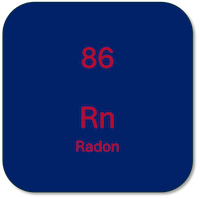

# Radon Information

  

## Websites  
- [Pennsylvania Department of Environmental Protection, Radon Division](https://www.dep.pa.gov/Business/RadiationProtection/RadonDivision/pages/default.aspx)  
- [Pennsylvania Radon Risk Map](https://Fwww.epa.gov/sites/default/files/2014-08/documents/pennsylvania.pdf) (downloads pdf file)  
- [U.S. Environmental Protection Agency](https://www.epa.gov/radon)  
- [World Health Organization](https://www.who.int/news-room/fact-sheets/detail/radon-and-health)  

## Guidebooks  
- Otton, J. K. (1992). The Geology of Radon. Denver, CO, USA: U.S. Geological Survey. Retrieved from [https://www.usgs.gov/faqs/what-radon](https://www.usgs.gov/faqs/what-radon)  
- Pennsylvania Radon Information Center. (2023). Pennsylvania Resident’s Guide to Radon (p. 24). Harrisburg, PA, USA: Department of Environmental Protection. Retrieved from [https://www.dep.pa.gov/Business/RadiationProtection/RadonDivision/pages/default.aspx](https://www.dep.pa.gov/Business/RadiationProtection/RadonDivision/pages/default.aspx)  
- USEPA. (2018). Home Buyer’s and Seller’s Guide to Radon (No. EPA 402/K-13/002) (p. 39). Washington, DC: Environmental Protection Agency. Retrieved from [https://www.epa.gov/sites/default/files/2015-05/documents/hmbuygud.pdf](https://www.epa.gov/sites/default/files/2015-05/documents/hmbuygud.pdf)  
- USEPA. (2012). A Citizen’s Guide to Radon (No. EPA 402/K-12/002) (p. 16). Washington, DC: Environmental Protection Agency. Retrieved from [https://www.epa.gov/sites/default/files/2016-12/documents/2016_a_citizens_guide_to_radon.pdf](https://www.epa.gov/sites/default/files/2016-12/documents/2016_a_citizens_guide_to_radon.pdf)  

## Summary of Reference Values  

|Source |Activity (pCi/L) |Activity (Bq/m3) |  
|---|---|---|  
|U.S. Environmental Protection Agency1 |**4** |148 3 |  
|World Health Organization2 |2.7 3 |**100** |  

1. The [USEPA](https://www.epa.gov/radon/what-epas-action-level-radon-and-what-does-it-mean) also recommends mitigation over 2 pCi/L.  
2. The [WHO](https://www.who.int/news-room/fact-sheets/detail/radon-and-health) recommends that countries set a reference level of 100 Bq/m3; however, if that is not possible, that it not exceed 300 Bq/m3.  
3. **Bold** values are the reference values, other values are provided for alternate units.  

## Selected Radon Research Papers  
- Brobbey, A., Rydz, E., Fenton, S., Demers, P. A., Ge, C. B., & Peters, C. E. (2022). Characterizing occupational radon exposure greater than 100 Bq/m3 in a highly exposed country. Scientific Reports, 12(1), 21323. [https://doi.org/10.1038/s41598-022-25547-x](https://doi.org/10.1038/s41598-022-25547-x)  
- Cohen, B. L., Kulwicki, D. R., Warner, K. R., & Grassi, C. L. (1984). Radon Concentrations Inside Public and Commercial Buildings in the Pittsburgh Area: Health Physics, 47(3), 399–405. [https://doi.org/10.1097/00004032-198409000-00005](https://doi.org/10.1097/00004032-198409000-00005)  
- Kellenbenz, K. R., & Shakya, K. M. (2021). Spatial and temporal variations in indoor radon concentrations in Pennsylvania, USA from 1988 to 2018. Journal of Environmental Radioactivity, 233, 106594. [https://doi.org/10.1016/j.jenvrad.2021.106594](https://doi.org/10.1016/j.jenvrad.2021.106594)  
- Stern, R. A., Lawrence, J., Wolfson, J. M., Li, L., & Koutrakis, P. (2023). Radon sampling methodologies: A case for accurate, accessible measurements using household instruments. Journal of the Air & Waste Management Association, 73(7), 519–524. [https://doi.org/10.1080/10962247.2023.2223149](https://doi.org/10.1080/10962247.2023.2223149)  

## Project Links  
This study is to quantify the radon present in homes and determine if awareness and education prompts those with radon present to mitigate radon risk.  This preliminary study will be used to estimate if a broader employee wellness program is well suited to assist employees make their home safer. This includes a participant placing a test kit in their home (provided by the study), reporting the results, and responding to surveys. All participants be provided standardized information on radon risk and mitigation from Pennsylvania and U.S. government sources.  If the levels of radon tested exceed standard levels (participants will be informed of the U.S. Environmental Protection Agency action level and the World Health Organization recommendations), we will provide mitigation recommendations again.  We will also ask three months after the test if mitigation steps have been taken. All information will be kept confidential and not attached to your address, but there is always a risk of a loss of confidentiality.  [Full consent form](https://duq.box.com/s/vvf1xn2la5zztmuskpbhudhion0bhs21)  

If you previously consented for this study and would like to withdraw: [Withdrawal Form](https://duq.az1.qualtrics.com/jfe/form/SV_eUUWkbICyBsbO5g)  

